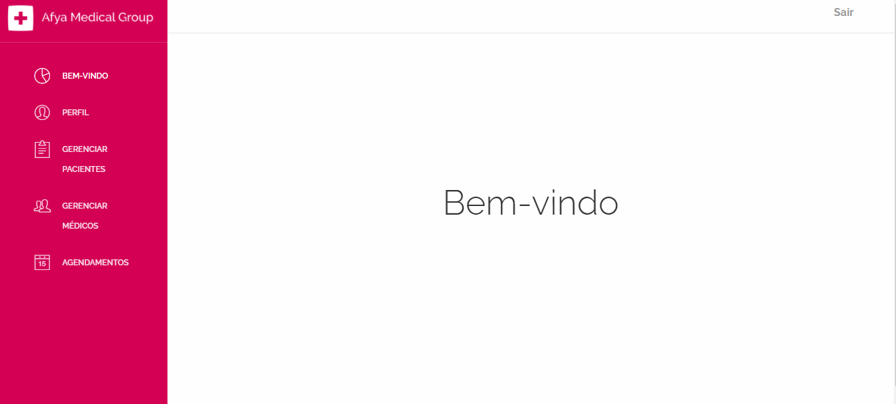
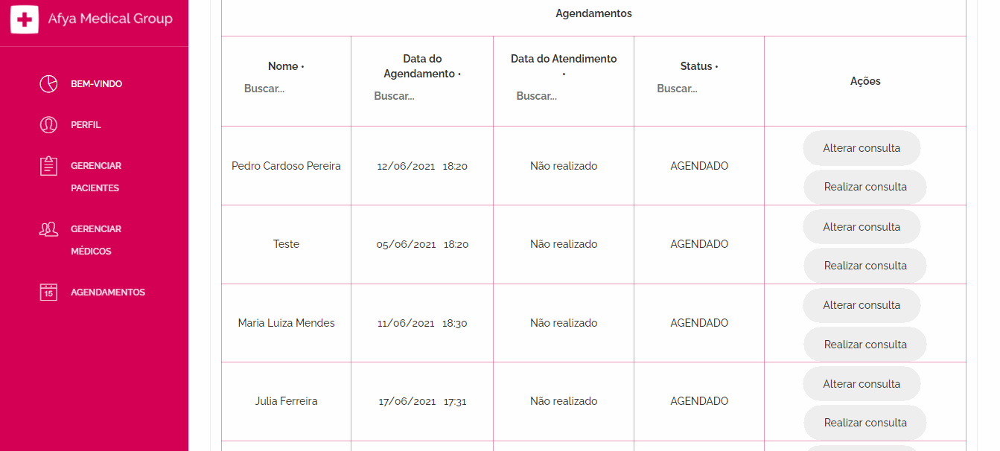

# gama-challenge-front
FrontEnd do **Sistema para gestão de consultório médico**, desenvolvido como proposta de desafio para a 1º edição do Afya Labs organizado pela [Afya](https://afya.com.br/) em parceria com a [Gama Academy](https://www.gama.academy/)


## 🚀 Começando

Essas instruções permitirão que você obtenha uma cópia do projeto em operação na sua máquina local para fins de desenvolvimento e teste.

Consulte **Implantação** para saber como implantar o projeto.

### 📋 Pré-requisitos

De que coisas você precisa para instalar o software e como instalá-lo?

* Node.js 14.17.0 
* React.js 17.0.2
* Yarn 1.22.10

### 🔧 Instalação

```
git clone https://github.com/GabrielPOliveira/gama-challenge-front.git
```

```
yarn install  or yarn
```

```
yarn start
```

### ⚙️ Principais funções do Sistema

* Troca de senha de usuário

* Gestão de Pacientes (Cadastro, Alteração, Busca, consulta do prontuário)

* Gestão de Médicos (Cadastro, Alteração)

* Agendamentos (Cadastro, Busca, Ordenação e realizar consulta)

### Gestão de Pacientes



------------------------
### Gestão de Médicos


------------------------
### Agendamentos



------------------------


## ✒️ Autores

* **Desenvolvedor** - *Criação do Layout, design, estilização, configuração da estrutura básica do React* - [André Akira](https://github.com/DevAndreAkira)

* **Desenvolvedor** - *Agendamentos, Meu Perfil,* - [Bruno Vercelli](https://github.com/bjmvercelli)

* **Desenvolvedor** - *Gestão de Médicos, Gestão de Pacientes e Documentação,* - [Gabriel P Oliveira](https://github.com/GabrielPOliveira/)

------------------------
## Link para acesso ao sistema

[Front-end](https://labteam-front.herokuapp.com/)

Dados para acesso: login = administrator  e senha admin123

